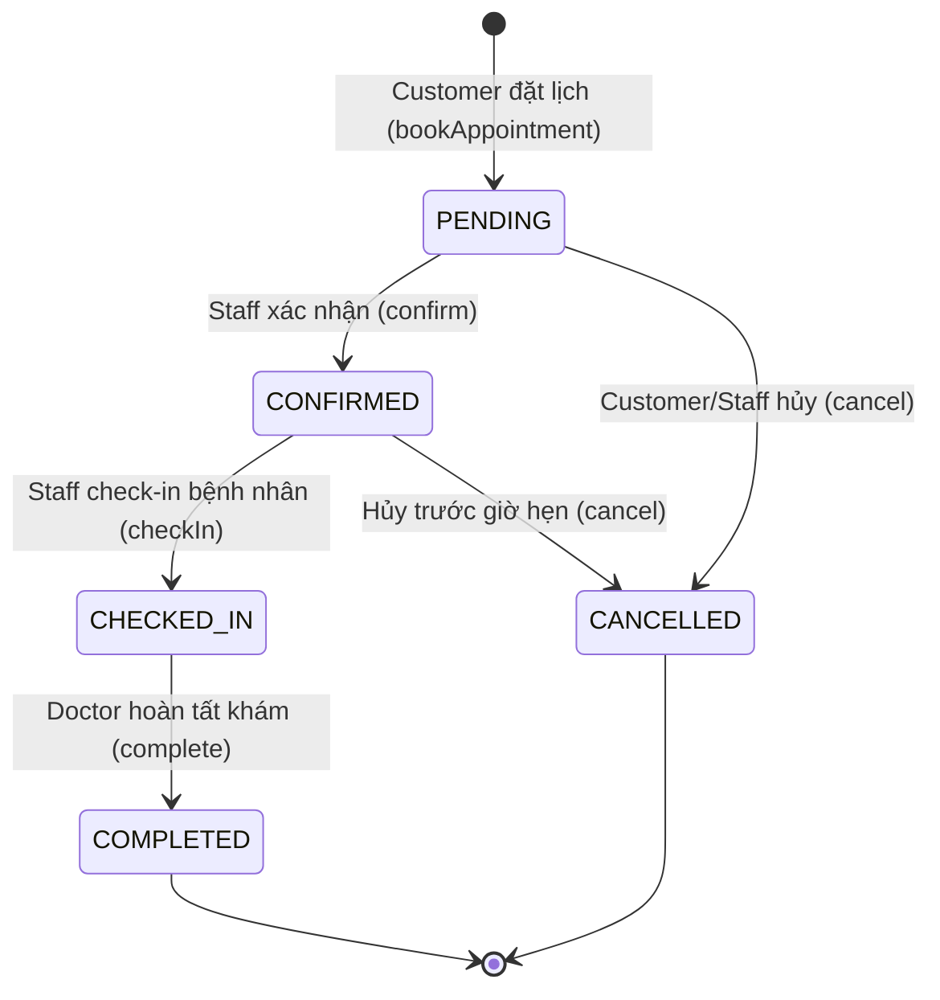

# Kế Hoạch & Đặt Tả Kiểm Thử Phần Mềm (ISTQB Test Plan & Specification) - DenCli v1.0

> **Dự án**: DenCli-version-2 — Hệ thống Quản lý Phòng khám Nha khoa
> **Chuẩn tham chiếu**: ISTQB Certified Tester Foundation Level Syllabus (Erik van Veenendaal et al., 2019) — kết hợp cấu trúc tài liệu theo ISO/IEC/IEEE 29119-3
> **Phân loại tài liệu**: Test Plan (Master) + Test Design Specification + Test Case Specification

---

## 1. DOCUMENT HEADER & METADATA

### 1.1. Thông tin tài liệu

| Thuộc tính | Giá trị |
|---|---|
| Mã tài liệu | DENCLI-QA-TP-001 |
| Tên tài liệu | Kế Hoạch & Đặt Tả Kiểm Thử Phần Mềm — DenCli v1.0 |
| Phiên bản | 1.0 |
| Trạng thái | Baselined / Chờ phê duyệt |
| Đối tượng kiểm thử (Test Object) | DenCli-version-2 (build `1.0.0-SNAPSHOT`) |
| Người soạn | Senior QA Architect (ISTQB CTFL) |
| Ngày phát hành | 16/09/2026 |

### 1.2. Lịch sử sửa đổi (Revision History)

| Version | Date | Author | Description |
|---|---|---|---|
| 0.1 | 01/09/2026 | QA Architect | Khởi tạo khung tài liệu, xác định phạm vi và Test Levels. |
| 0.2 | 05/09/2026 | QA Architect | Bổ sung đặc tả Black-box: EP/BVA cho Stock Deduction. |
| 0.3 | 09/09/2026 | QA Architect | Bổ sung Decision Table cho RBAC (`AuthorizationFilter`). |
| 0.4 | 12/09/2026 | QA Architect | Bổ sung State Transition cho `AppointmentStatus` và kịch bản E2E. |
| 0.9 | 14/09/2026 | QA Architect | Bổ sung White-box Coverage, Risk Matrix, Defect Management. |
| **1.0** | **16/09/2026** | **QA Architect** | **Hoàn thiện, rà soát chéo, baseline để phê duyệt.** |

### 1.3. Người phê duyệt (Approval)

| Vai trò | Họ tên | Chữ ký | Ngày |
|---|---|---|---|
| Project Manager | | | |
| Technical Lead | | | |
| QA Lead | | | |

### 1.4. Thuật ngữ & Từ viết tắt

| Thuật ngữ | Giải thích |
|---|---|
| EP | Equivalence Partitioning — Phân vùng tương đương |
| BVA | Boundary Value Analysis — Phân tích giá trị biên |
| DT | Decision Table Testing — Kiểm thử bảng quyết định |
| STT | State Transition Testing — Kiểm thử chuyển trạng thái |
| RBAC | Role-Based Access Control — Kiểm soát truy cập theo vai trò |
| SUT | System Under Test — Hệ thống được kiểm thử |
| DAO | Data Access Object |
| RTM | Requirements Traceability Matrix — Ma trận truy vết yêu cầu |
| ACID | Atomicity, Consistency, Isolation, Durability |

### 1.5. Executive Summary

DenCli-version-2 là hệ thống quản lý phòng khám nha khoa xây dựng trên kiến trúc **3-Tier MVC** thuần Java: tầng Presentation (JSP/JSTL + Bootstrap 5), tầng Controller/Business (Java Servlet + Service), tầng Data Access (Pure JDBC qua `DriverManager` tới SQL Server). Hệ thống phục vụ 4 nhóm người dùng với quyền hạn tách biệt (`ADMIN`, `DOCTOR`, `STAFF`, `CUSTOMER`) và chứa các luồng nghiệp vụ có **rủi ro cao về toàn vẹn dữ liệu**: kê đơn thuốc kèm trừ tồn kho tự động và lập hóa đơn thanh toán — cả hai đều ghi trên nhiều bảng trong cùng một transaction JDBC thủ công.

Tài liệu này định nghĩa chiến lược, phạm vi, tiêu chí vào/ra, kỹ thuật thiết kế test case và quy trình quản lý lỗi cho toàn bộ chu kỳ kiểm thử phiên bản 1.0. Do dự án **không sử dụng framework (không Spring, không JPA)**, phần lớn logic bảo mật và giao dịch được viết tay trong `Filter` và `Service`; vì vậy tài liệu đặt trọng tâm rủi ro vào hai khu vực này thay vì phân bổ đều nỗ lực kiểm thử (nguyên tắc ISTQB: *Defect clustering* và *Testing is context dependent*).

### 1.6. Mục tiêu kiểm thử (Test Objectives)

| ID | Mục tiêu | Tiêu chí đo lường |
|---|---|---|
| OBJ-01 | Xác nhận các chức năng nghiệp vụ cốt lõi hoạt động đúng đặc tả SRS | 100% test case Critical/Major PASS |
| OBJ-02 | Ngăn chặn truy cập trái phép giữa các vai trò (privilege escalation ngang & dọc) | 0 lỗi RBAC mức Severity 1 |
| OBJ-03 | Đảm bảo tính nguyên tử (Atomicity) của transaction kê đơn & trừ kho | 0 trường hợp dữ liệu mồ côi sau rollback |
| OBJ-04 | Ngăn chặn tồn kho âm trong mọi kịch bản biên và đồng thời | Stock_Qty ≥ 0 tại mọi thời điểm |
| OBJ-05 | Đảm bảo vòng đời lịch hẹn không cho phép chuyển trạng thái bất hợp lệ | 100% invalid transition bị từ chối |
| OBJ-06 | Đạt mức bao phủ mã nguồn tối thiểu cho các module rủi ro cao | Branch Coverage ≥ 85% (Filter, Service transaction) |
| OBJ-07 | Xác nhận hiển thị tiếng Việt chính xác (UTF-8) toàn hệ thống | 0 lỗi mojibake trên UI và DB |
| OBJ-08 | Cung cấp thông tin đủ để các bên liên quan ra quyết định release | Test Summary Report được ký duyệt |

---

## 2. TEST STRATEGY & SCOPE (ISTQB STANDARD)

### 2.1. Phạm vi kiểm thử

#### 2.1.1. Trong phạm vi (In Scope)

| Module | Thành phần chính | Mức độ ưu tiên |
|---|---|---|
| Xác thực & Phân quyền | `AuthenticationFilter`, `AuthorizationFilter`, `LoginServlet`, `LogoutServlet` | **Critical** |
| Quản lý tài khoản | `RegisterServlet`, `UserManagementServlet`, `ProfileServlet` | Major |
| Đặt & quản lý lịch hẹn | `AppointmentBookingServlet`, `ReceptionServlet`, `AppointmentService` | **Critical** |
| Khám & Kê đơn | `ExaminationServlet`, `PrescriptionServlet`, `PrescriptionService` | **Critical** |
| Quản lý kho thuốc | `MedicineServlet`, `StockService`, `MedicineDAO` | **Critical** |
| Thanh toán & Hóa đơn | `BillingService`, `InvoiceServlet` | **Critical** |
| Tầng truy cập dữ liệu | Toàn bộ DAO sử dụng `PreparedStatement` | Major |
| Mã hóa ký tự | `CharacterEncodingFilter` (UTF-8) | Medium |

#### 2.1.2. Ngoài phạm vi (Out of Scope)

- Kiểm thử hiệu năng tải cao (Load/Stress Testing) — hoãn sang phiên bản 1.1.
- Kiểm thử khả năng tương thích trình duyệt cũ (IE11, Safari < 14).
- Penetration Testing chuyên sâu do đơn vị thứ ba thực hiện (chỉ thực hiện Security Testing cấp chức năng cho RBAC).
- Kiểm thử hạ tầng SQL Server (backup/restore, replication).
- Kiểm thử ứng dụng di động (chưa tồn tại trong phạm vi v1.0).

### 2.2. Test Levels (Cấp độ kiểm thử)

Theo ISTQB CTFL chương 2.2, dự án áp dụng 3 cấp độ:

#### 2.2.1. Unit / Component Testing

| Thuộc tính | Mô tả |
|---|---|
| **Test Basis** | Mã nguồn lớp `Service`, `DAO`, `Util`, `Validator`; thiết kế chi tiết lớp |
| **Test Object** | Từng lớp/phương thức riêng lẻ |
| **Trách nhiệm** | Developer (hỗ trợ bởi QA trong review test case) |
| **Công cụ** | JUnit 5 (`junit-jupiter`), Mockito, H2/SQL Server test schema |
| **Chiến lược cô lập** | Mock `Connection`, `PreparedStatement`, `ResultSet` khi kiểm thử DAO; mock DAO khi kiểm thử Service |
| **Lỗi điển hình cần phát hiện** | Sai công thức tính tiền, sai điều kiện biên tồn kho, `null` không được xử lý, thiếu `rollback()` trong `catch` |
| **Tiêu chí bao phủ** | Statement ≥ 80%, Branch ≥ 85% cho lớp Service/Filter |

#### 2.2.2. Integration Testing

| Thuộc tính | Mô tả |
|---|---|
| **Test Basis** | Sơ đồ tuần tự, thiết kế kiến trúc 3 tầng, lược đồ CSDL `DenCli.sql` |
| **Test Object** | Servlet ↔ Service ↔ DAO ↔ SQL Server; chuỗi Filter Chain |
| **Loại tích hợp** | *Component Integration* (Service ↔ DAO thật, DB thật) và *Filter Chain Integration* |
| **Chiến lược** | Bottom-up: kiểm thử DAO với DB test trước, sau đó ghép Service, cuối cùng là Servlet qua HTTP |
| **Công cụ** | JUnit 5 + Testcontainers (SQL Server) hoặc DB schema `DenCli_Test`, `mockito-inline`, Apache HttpClient |
| **Lỗi điển hình cần phát hiện** | Transaction không lan truyền đúng giữa 2 DAO cùng `Connection`, `setAutoCommit(false)` bị mất khi Service gọi chồng, sai kiểu dữ liệu giữa Java và SQL Server (`NVARCHAR` vs `VARCHAR`), session attribute không nhất quán giữa Filter và Servlet |

#### 2.2.3. System Testing

| Thuộc tính | Mô tả |
|---|---|
| **Test Basis** | SRS, use case, quy trình nghiệp vụ phòng khám, yêu cầu phi chức năng |
| **Test Object** | Toàn bộ ứng dụng đã triển khai trên Tomcat, kết nối SQL Server thật |
| **Môi trường** | Giống production (cấu hình, dữ liệu mẫu, encoding) |
| **Kỹ thuật** | Black-box: EP, BVA, Decision Table, State Transition, Use Case Testing |
| **Trách nhiệm** | Đội QA độc lập |
| **Lỗi điển hình cần phát hiện** | Luồng E2E đứt gãy giữa các vai trò, sai thông điệp lỗi tiếng Việt, mất dữ liệu khi điều hướng, quyền truy cập rò rỉ qua URL trực tiếp |

> **Ghi chú (Acceptance Testing)**: UAT do khách hàng (đại diện phòng khám) thực hiện sau khi System Testing đạt Exit Criteria. Tài liệu này không đặc tả UAT nhưng cung cấp bộ test case E2E làm đầu vào tham khảo.

### 2.3. Test Types (Loại hình kiểm thử)

#### 2.3.1. Functional Testing

Xác minh **hệ thống làm gì** — đối chiếu với yêu cầu chức năng. Áp dụng cho toàn bộ module trong phạm vi. Kỹ thuật chủ đạo: EP, BVA, Decision Table, State Transition, Use Case Testing.

#### 2.3.2. Security Testing (RBAC-focused)

Là một loại kiểm thử phi chức năng theo ISTQB. Trọng tâm:

| Khía cạnh | Nội dung kiểm thử |
|---|---|
| Authentication | Truy cập tài nguyên bảo vệ khi chưa đăng nhập; session hết hạn; đăng xuất vô hiệu hóa session |
| Vertical Privilege Escalation | `CUSTOMER` gọi trực tiếp URL `/admin/users` |
| Horizontal Privilege Escalation | `CUSTOMER_A` truy cập hồ sơ `CUSTOMER_B` qua tham số `?patientId=` (IDOR) |
| Session Fixation | Session ID phải được tái tạo (`session.invalidate()` + tạo mới) sau đăng nhập thành công |
| Injection | Xác nhận 100% truy vấn dùng `PreparedStatement` với tham số hóa, không nối chuỗi SQL |
| XSS | Dữ liệu người dùng hiển thị qua JSTL `<c:out>` hoặc `${fn:escapeXml()}` |
| Response Semantics | AJAX trả 401/403 JSON thay vì redirect HTML |

#### 2.3.3. Transactional Integrity Testing

Kiểm thử chuyên biệt cho tính ACID của các giao dịch JDBC thủ công:

| Kịch bản | Kỳ vọng |
|---|---|
| Kê đơn thành công 3 loại thuốc | `commit()` một lần, 3 bản ghi `PrescriptionDetail` + 3 lần `UPDATE Medicine` |
| Thuốc thứ 3 vượt tồn kho | `rollback()` toàn bộ — không tồn tại bản ghi `Prescription` header, tồn kho 2 thuốc đầu **không thay đổi** |
| Mất kết nối DB giữa chừng | `rollback()` trong `catch`, `Connection` được đóng trong `finally`, không rò rỉ kết nối |
| `setAutoCommit(true)` được khôi phục | Sau `finally`, connection trả về pool/đóng ở trạng thái sạch |
| Hai bác sĩ kê cùng thuốc cuối cùng đồng thời | Không cho phép tồn kho âm (kiểm thử race condition với 2 luồng) |

### 2.4. Entry Criteria (Tiêu chí bắt đầu kiểm thử)

Kiểm thử hệ thống **chỉ được bắt đầu** khi tất cả điều kiện sau thỏa mãn:

| ID | Tiêu chí | Cách xác minh |
|---|---|---|
| EN-01 | Maven build biên dịch thành công với **0 lỗi cú pháp** | `mvn clean compile` trả exit code 0 |
| EN-02 | Gói WAR được đóng gói và triển khai thành công lên Tomcat | `mvn clean package` + Tomcat log không có `SEVERE` |
| EN-03 | CSDL SQL Server đã khởi tạo bằng script `DenCli.sql` | Kiểm tra tồn tại đầy đủ bảng + dữ liệu master (roles, medicines) |
| EN-04 | Dữ liệu kiểm thử (test data) đã được nạp cho 4 vai trò | Đăng nhập thử 4 tài khoản mẫu thành công |
| EN-05 | Test Plan này đã được phê duyệt | Có chữ ký mục 1.3 |
| EN-06 | Môi trường Test đã sẵn sàng và cô lập khỏi Production | Chuỗi kết nối trỏ tới `DenCli_Test` |
| EN-07 | Smoke Test (kiểm thử thông khói) PASS | Đăng nhập, đặt lịch, mở trang kho — không lỗi HTTP 500 |
| EN-08 | Không còn defect Severity 1 tồn đọng từ vòng test trước | Truy vấn bug tracker |

### 2.5. Exit Criteria (Tiêu chí kết thúc kiểm thử)

| ID | Tiêu chí | Ngưỡng |
|---|---|---|
| EX-01 | Tỷ lệ PASS test case mức Critical & Major | **100%** |
| EX-02 | Tỷ lệ PASS test case mức Medium & Minor | ≥ 95% |
| EX-03 | Defect mở ở mức Severity 1 (Critical) & Severity 2 (Major) | **0** |
| EX-04 | Defect mở ở mức Severity 3 (Medium) | ≤ 3 và có workaround được chấp nhận |
| EX-05 | Lệnh `mvn clean test` thực thi thành công (BUILD SUCCESS) | Bắt buộc |
| EX-06 | Branch Coverage cho `*Filter` và `*Service` (khối transaction) | ≥ 85% |
| EX-07 | Tỷ lệ thực thi test case đã lập kế hoạch | 100% (không còn Blocked/Not Run) |
| EX-08 | Ma trận truy vết yêu cầu (RTM) đầy đủ, mọi yêu cầu có ít nhất 1 test case | 100% |
| EX-09 | Test Summary Report được QA Lead và PM ký duyệt | Bắt buộc |

### 2.6. Suspension & Resumption Criteria

| Loại | Điều kiện |
|---|---|
| **Suspension** (tạm dừng) | (a) Không thể đăng nhập với bất kỳ vai trò nào; (b) CSDL không khả dụng > 2 giờ; (c) > 30% test case mức Critical FAIL trong cùng một build; (d) Phát hiện lỗ hổng RBAC cho phép `CUSTOMER` truy cập chức năng `ADMIN` |
| **Resumption** (tiếp tục) | Defect gây tạm dừng đã được fix, verify PASS, và Smoke Test được chạy lại đầy đủ trên build mới |

### 2.7. Môi trường kiểm thử (Test Environment)

| Thành phần | Cấu hình |
|---|---|
| Application Server | Apache Tomcat (Servlet container), cổng 8080 |
| CSDL | Microsoft SQL Server — database `DenCli_Test`, khởi tạo từ `DenCli.sql` |
| Kết nối CSDL | Pure JDBC — `DriverManager.getConnection()` (không dùng connection pool) |
| Build tool | Apache Maven |
| JDK | Theo cấu hình `maven.compiler.source/target` trong `pom.xml` |
| Encoding | `UTF-8` toàn tuyến: request/response, JSP `pageEncoding`, cột DB kiểu `NVARCHAR` |
| Trình duyệt | Chrome (mới nhất), Firefox (mới nhất), Edge (mới nhất) |
| Công cụ test | JUnit 5, Mockito, JaCoCo, Postman/cURL (AJAX), DevTools |

### 2.8. Dữ liệu kiểm thử chuẩn (Test Data Baseline)

| Tài khoản | RoleID | Vai trò | Mục đích |
|---|---|---|---|
| `admin01` | 1 | ADMIN | Kiểm thử quản trị toàn hệ thống |
| `doctor01` | 2 | DOCTOR | Kiểm thử khám bệnh, kê đơn |
| `doctor02` | 2 | DOCTOR | Kiểm thử phân tách dữ liệu ngang giữa 2 bác sĩ |
| `staff01` | 4 | STAFF | Kiểm thử lễ tân, thanh toán |
| `customer01` | 5 | CUSTOMER | Kiểm thử đặt lịch, xem hồ sơ cá nhân |
| `customer02` | 5 | CUSTOMER | Kiểm thử IDOR (truy cập hồ sơ người khác) |

| Thuốc mẫu | MedicineID | Stock_Qty | Mục đích |
|---|---|---|---|
| Amoxicillin 500mg | MED001 | 100 | Kiểm thử biên tồn kho lớn |
| Paracetamol 500mg | MED002 | 1 | Kiểm thử biên tối thiểu (min) |
| Metronidazole 250mg | MED003 | 0 | Kiểm thử hết hàng |
| Ibuprofen 400mg | MED004 | 50 | Kiểm thử rollback đa dòng |

### 2.9. Vai trò & Trách nhiệm

| Vai trò | Trách nhiệm |
|---|---|
| QA Lead / Test Manager | Lập kế hoạch, giám sát tiến độ, ra quyết định Entry/Exit, báo cáo |
| Test Analyst | Phân tích Test Basis, thiết kế test case (EP/BVA/DT/STT), lập RTM |
| Test Engineer | Thực thi test case, ghi nhận và phân loại defect, retest & regression |
| Automation Engineer | Xây dựng và duy trì bộ test JUnit, tích hợp JaCoCo, cấu hình Maven |
| Developer | Viết Unit Test, sửa defect, hỗ trợ dựng môi trường |

---

## 3. BLACK-BOX TEST SPECIFICATIONS

Quy ước đặt mã test case:

| Tiền tố | Ý nghĩa |
|---|---|
| `TC_EP_xxx` | Equivalence Partitioning |
| `TC_BVA_xxx` | Boundary Value Analysis |
| `TC_DT_xxx` | Decision Table |
| `TC_ST_xxx` | State Transition |
| `TC_E2E_xxx` | Use Case / End-to-End |

### A. Equivalence Partitioning (EP) & Boundary Value Analysis (BVA)

#### A.1. Phân tích phân vùng — `RegisterServlet` (Form Validation)

| Trường | Phân vùng hợp lệ (Valid) | Phân vùng không hợp lệ (Invalid) |
|---|---|---|
| `username` | Chuỗi chữ-số, độ dài 6–30, chưa tồn tại trong DB | Rỗng; < 6 ký tự; > 30 ký tự; chứa ký tự đặc biệt; đã tồn tại |
| `password` | Độ dài 8–50, có chữ hoa + chữ thường + số | Rỗng; < 8 ký tự; > 50 ký tự; chỉ chứa số |
| `confirmPassword` | Trùng khớp `password` | Không trùng khớp; rỗng |
| `email` | Đúng định dạng `local@domain.tld`, chưa tồn tại | Thiếu `@`; thiếu domain; rỗng; đã tồn tại |
| `phone` | 10 chữ số, bắt đầu bằng `0` | 9 chữ số; 11 chữ số; chứa chữ cái; rỗng |
| `fullName` | 2–100 ký tự, hỗ trợ tiếng Việt có dấu (UTF-8) | Rỗng; > 100 ký tự |

#### A.2. Phân tích phân vùng & biên — Trừ tồn kho thuốc (`PrescriptionService`)

Đặt `S` = `Stock_Qty` hiện tại của thuốc, `q` = số lượng bác sĩ kê.

| Phân vùng | Miền giá trị | Loại | Hành vi kỳ vọng |
|---|---|---|---|
| EP-1 | `q ≤ -1` | Invalid | Từ chối, thông báo lỗi validation, **không mở transaction** |
| EP-2 | `q = 0` | Invalid | Từ chối, thông báo "Số lượng phải lớn hơn 0" |
| EP-3 | `1 ≤ q ≤ S` | **Valid** | Ghi đơn thuốc + `UPDATE Medicine SET Stock_Qty = S - q`, `commit()` |
| EP-4 | `q > S` | Invalid | `rollback()` toàn bộ, thông báo "Không đủ tồn kho" |
| EP-5 | `q` không phải số nguyên (chữ, rỗng, thập phân) | Invalid | Từ chối ở tầng validation trước khi tới Service |

**Giá trị biên được chọn (2-value BVA)**: `-1`, `0`, `1`, `2`, `S-1`, `S`, `S+1`.

#### A.3. Bảng đặc tả Test Case — EP & BVA

> Dữ liệu tham chiếu: `MED001` có `S = 100`; `MED002` có `S = 1`; `MED003` có `S = 0`.

| Test Case ID | Test Level | Feature / Target | Input Data & Conditions | Expected Result |
|---|---|---|---|---|
| TC_EP_001 | System | `RegisterServlet` — username | `username = "nguyenvan"` (9 ký tự, chưa tồn tại), các trường khác hợp lệ | HTTP 302 → `/login`; bản ghi User được tạo với `RoleID = 5`; mật khẩu lưu dạng hash |
| TC_EP_002 | System | `RegisterServlet` — username | `username = "abc"` (3 ký tự) | Ở lại trang đăng ký; hiển thị "Tên đăng nhập phải từ 6 đến 30 ký tự"; **không** tạo bản ghi DB |
| TC_EP_003 | System | `RegisterServlet` — username | `username = ""` (rỗng) | Hiển thị lỗi bắt buộc nhập; không gọi DAO |
| TC_EP_004 | Integration | `RegisterServlet` — username trùng | `username = "customer01"` (đã tồn tại) | Hiển thị "Tên đăng nhập đã tồn tại"; không phát sinh `SQLException` unique constraint tới người dùng |
| TC_EP_005 | System | `RegisterServlet` — password | `password = "Abc12345"` (8 ký tự hợp lệ), `confirmPassword` trùng | Đăng ký thành công |
| TC_EP_006 | System | `RegisterServlet` — password | `password = "Abc123"` (6 ký tự) | Lỗi "Mật khẩu phải có ít nhất 8 ký tự" |
| TC_EP_007 | System | `RegisterServlet` — confirm password | `password = "Abc12345"`, `confirmPassword = "Abc12346"` | Lỗi "Mật khẩu xác nhận không khớp"; không tạo tài khoản |
| TC_EP_008 | System | `RegisterServlet` — email | `email = "nguyenvan@clinic.vn"` | Hợp lệ, đăng ký thành công |
| TC_EP_009 | System | `RegisterServlet` — email | `email = "nguyenvan.clinic.vn"` (thiếu `@`) | Lỗi "Email không đúng định dạng" |
| TC_EP_010 | System | `RegisterServlet` — phone | `phone = "0912345678"` (10 số) | Hợp lệ |
| TC_EP_011 | System | `RegisterServlet` — phone | `phone = "091234567"` (9 số) | Lỗi "Số điện thoại phải gồm 10 chữ số" |
| TC_EP_012 | System | `RegisterServlet` — phone | `phone = "09123456789"` (11 số) | Lỗi "Số điện thoại phải gồm 10 chữ số" |
| TC_EP_013 | System | `RegisterServlet` — UTF-8 | `fullName = "Nguyễn Thị Hồng Đào"` | Lưu và hiển thị lại đúng dấu tiếng Việt (cột `NVARCHAR`), không mojibake |
| TC_BVA_001 | Unit | `PrescriptionService` — biên dưới invalid | `MED001` (S=100), `q = -1` | Ném `InvalidQuantityException` / trả lỗi validation; **không** gọi `setAutoCommit(false)`; `Stock_Qty` giữ nguyên 100 |
| TC_BVA_002 | Unit | `PrescriptionService` — biên `0` | `MED001` (S=100), `q = 0` | Từ chối với thông báo "Số lượng phải lớn hơn 0"; `Stock_Qty` = 100 |
| TC_BVA_003 | Integration | `PrescriptionService` — biên dưới valid (min) | `MED001` (S=100), `q = 1` | `commit()` thành công; `Stock_Qty` = 99; tạo 1 bản ghi `PrescriptionDetail` |
| TC_BVA_004 | Integration | `PrescriptionService` — giá trị valid kế biên | `MED001` (S=100), `q = 2` | `commit()`; `Stock_Qty` = 98 |
| TC_BVA_005 | Integration | `PrescriptionService` — biên trên valid `S-1` | `MED001` (S=100), `q = 99` | `commit()`; `Stock_Qty` = 1 |
| TC_BVA_006 | Integration | `PrescriptionService` — biên trên valid `S` (max) | `MED001` (S=100), `q = 100` | `commit()`; `Stock_Qty` = **0**; hệ thống không báo lỗi; thuốc chuyển trạng thái "Hết hàng" |
| TC_BVA_007 | Integration | `PrescriptionService` — vượt tồn kho `S+1` | `MED001` (S=100), `q = 101` | `rollback()` được gọi; `Stock_Qty` vẫn = 100; **không** tồn tại bản ghi `Prescription` header; hiển thị "Không đủ tồn kho (còn 100)" |
| TC_BVA_008 | Integration | `StockService` — thuốc có tồn kho tối thiểu | `MED002` (S=1), `q = 1` | `commit()`; `Stock_Qty` = 0 |
| TC_BVA_009 | Integration | `StockService` — vượt tồn kho tối thiểu | `MED002` (S=1), `q = 2` | `rollback()`; `Stock_Qty` = 1 |
| TC_BVA_010 | Integration | `StockService` — thuốc đã hết hàng | `MED003` (S=0), `q = 1` | `rollback()`; `Stock_Qty` = 0; thông báo "Thuốc đã hết hàng" |
| TC_BVA_011 | System | `PrescriptionServlet` — kiểu dữ liệu | `quantity = "abc"` | Lỗi validation phía server (không chỉ phía client); không có `NumberFormatException` lộ ra trang lỗi 500 |
| TC_BVA_012 | System | `PrescriptionServlet` — bỏ trống | `quantity = ""` | Lỗi "Vui lòng nhập số lượng" |
| TC_BVA_013 | Integration | **Rollback đa bảng** | Đơn thuốc gồm: `MED001` q=5 (OK), `MED004` q=10 (OK), `MED002` q=5 (vượt S=1) | **Toàn bộ** transaction `rollback()`: `MED001` = 100, `MED004` = 50, `MED002` = 1; không bản ghi `Prescription` / `PrescriptionDetail` nào được tạo |
| TC_BVA_014 | Integration | Toàn vẹn khi lỗi kết nối | Ngắt kết nối DB sau khi `INSERT Prescription`, trước `UPDATE Medicine` | `rollback()` trong `catch (SQLException)`; `Connection` đóng trong `finally`; hiển thị thông báo lỗi thân thiện, không lộ stack trace |
| TC_BVA_015 | Integration | Đồng thời (race condition) | 2 luồng cùng kê `MED002` (S=1) với `q = 1` tại cùng thời điểm | Chỉ 1 luồng `commit()` thành công; luồng còn lại `rollback()`; `Stock_Qty` cuối cùng = 0 (**không bao giờ âm**) |
| TC_BVA_016 | Unit | Khôi phục AutoCommit | Sau mọi kịch bản commit và rollback | `connection.setAutoCommit(true)` được gọi trước khi đóng; không rò rỉ trạng thái transaction |

---

### B. Decision Table Testing — Authorization & Authentication Matrix

**Đối tượng**: `AuthenticationFilter` (kiểm tra đã đăng nhập) và `AuthorizationFilter` (kiểm tra vai trò).

#### B.1. Điều kiện & Hành động

| Ký hiệu | Điều kiện (Condition) | Giá trị |
|---|---|---|
| C1 | Đã đăng nhập (session tồn tại & hợp lệ) | Y / N |
| C2 | Vai trò người dùng (`RoleID`) | ADMIN(1) / DOCTOR(2) / STAFF(4) / CUSTOMER(5) / — |
| C3 | Tài nguyên đích (Target Resource) | `/admin/*`, `/doctor/*`, `/staff/*`, `/customer/*`, `/api/*`, public |
| C4 | Loại request | Page (HTML) / AJAX (`X-Requested-With: XMLHttpRequest`) |

| Ký hiệu | Hành động (Action) |
|---|---|
| A1 | HTTP 200 — Cho phép, `chain.doFilter()` được gọi |
| A2 | HTTP 302 — Redirect tới `/login?redirect=<originalURL>` |
| A3 | HTTP 401 — JSON `{"error":"UNAUTHENTICATED"}` |
| A4 | HTTP 403 — Trang `access-denied.jsp` hoặc JSON `{"error":"FORBIDDEN"}` |

#### B.2. Bảng quyết định (Decision Table)

| Rule | C1 Logged In | C2 User Role | C3 Target Resource | C4 Request Type | Expected Status | Action |
|---|---|---|---|---|---|---|
| R01 | N | — | `/login`, `/register`, `/` (public) | Page | **200** | A1 |
| R02 | N | — | `/admin/*` | Page | **302** → `/login` | A2 |
| R03 | N | — | `/doctor/*` | Page | **302** → `/login` | A2 |
| R04 | N | — | `/staff/*` | Page | **302** → `/login` | A2 |
| R05 | N | — | `/customer/*` | Page | **302** → `/login` | A2 |
| R06 | N | — | `/api/*` | AJAX | **401** | A3 |
| R07 | Y | ADMIN (1) | `/admin/*` | Page | **200** | A1 |
| R08 | Y | ADMIN (1) | `/doctor/*`, `/staff/*` | Page | **200** (ADMIN có quyền giám sát) | A1 |
| R09 | Y | ADMIN (1) | `/api/admin/*` | AJAX | **200** | A1 |
| R10 | Y | DOCTOR (2) | `/doctor/*` | Page | **200** | A1 |
| R11 | Y | DOCTOR (2) | `/admin/*` | Page | **403** | A4 |
| R12 | Y | DOCTOR (2) | `/staff/*` | Page | **403** | A4 |
| R13 | Y | DOCTOR (2) | `/api/admin/users` | AJAX | **403** (JSON) | A4 |
| R14 | Y | STAFF (4) | `/staff/*` | Page | **200** | A1 |
| R15 | Y | STAFF (4) | `/doctor/examination` | Page | **403** | A4 |
| R16 | Y | STAFF (4) | `/admin/*` | Page | **403** | A4 |
| R17 | Y | STAFF (4) | `/api/staff/appointments` | AJAX | **200** | A1 |
| R18 | Y | CUSTOMER (5) | `/customer/*` | Page | **200** | A1 |
| R19 | Y | CUSTOMER (5) | `/admin/*` | Page | **403** | A4 |
| R20 | Y | CUSTOMER (5) | `/doctor/*` | Page | **403** | A4 |
| R21 | Y | CUSTOMER (5) | `/staff/*` | Page | **403** | A4 |
| R22 | Y | CUSTOMER (5) | `/api/admin/*` | AJAX | **403** (JSON) | A4 |
| R23 | Y | CUSTOMER (5) | `/customer/profile?userId=<của người khác>` | Page | **403** (chống IDOR) | A4 |
| R24 | Y (session hết hạn) | — | `/doctor/*` | Page | **302** → `/login?expired=true` | A2 |
| R25 | Y (session hết hạn) | — | `/api/*` | AJAX | **401** (JSON) | A3 |
| R26 | Y | Bất kỳ | `/logout` | Page | **302** → `/login`; session bị `invalidate()` | A2 |

#### B.3. Test Case dẫn xuất từ Decision Table

| Test Case ID | Test Level | Rule | Feature / Target | Input Data & Conditions | Expected Result |
|---|---|---|---|---|---|
| TC_DT_001 | Integration | R01 | `AuthenticationFilter` | GET `/login` không có session | HTTP 200, trang đăng nhập hiển thị |
| TC_DT_002 | System | R02 | `AuthenticationFilter` | GET `/admin/users` không đăng nhập | HTTP 302 → `/login?redirect=/admin/users`; sau khi đăng nhập ADMIN, tự động quay lại `/admin/users` |
| TC_DT_003 | System | R06 | `AuthenticationFilter` (AJAX) | GET `/api/appointments` với header `X-Requested-With: XMLHttpRequest`, không session | HTTP **401**, body JSON, **không** trả HTML của trang login |
| TC_DT_004 | Integration | R07 | `AuthorizationFilter` | Đăng nhập `admin01`, GET `/admin/users` | HTTP 200, danh sách người dùng hiển thị |
| TC_DT_005 | System | R11 | `AuthorizationFilter` | Đăng nhập `doctor01`, gõ trực tiếp URL `/admin/users` | HTTP **403**, trang `access-denied.jsp`; ghi log cảnh báo truy cập trái phép |
| TC_DT_006 | System | R13 | `AuthorizationFilter` (AJAX) | Đăng nhập `doctor01`, gọi AJAX `/api/admin/users` | HTTP **403**, body JSON `{"error":"FORBIDDEN"}` |
| TC_DT_007 | System | R15 | `AuthorizationFilter` | Đăng nhập `staff01`, GET `/doctor/examination?appointmentId=1` | HTTP **403**; không lộ dữ liệu y tế |
| TC_DT_008 | System | R19 | `AuthorizationFilter` — leo thang dọc | Đăng nhập `customer01`, GET `/admin/medicine/delete?id=MED001` | HTTP **403**; `MED001` vẫn tồn tại trong DB |
| TC_DT_009 | System | R23 | `AuthorizationFilter` — IDOR (leo thang ngang) | Đăng nhập `customer01`, GET `/customer/profile?userId=<ID của customer02>` | HTTP **403** hoặc chỉ hiển thị hồ sơ của chính `customer01`; tuyệt đối không hiển thị dữ liệu `customer02` |
| TC_DT_010 | System | R24 | Session timeout | Đăng nhập `doctor01`, chờ quá `session-timeout`, GET `/doctor/schedule` | HTTP 302 → `/login?expired=true`, hiển thị "Phiên làm việc đã hết hạn" |
| TC_DT_011 | System | R26 | `LogoutServlet` | Đăng nhập, GET `/logout`, sau đó dùng lại `JSESSIONID` cũ truy cập `/doctor/*` | Session cũ vô hiệu; HTTP 302 → `/login` |
| TC_DT_012 | System | — | Session Fixation | Ghi `JSESSIONID` trước đăng nhập, đăng nhập thành công, so sánh `JSESSIONID` sau | Session ID **phải khác** trước và sau đăng nhập |
| TC_DT_013 | Integration | — | `LoginServlet` — sai mật khẩu | `username = "admin01"`, `password = "sai_mat_khau"` | HTTP 200 ở trang login; thông báo chung "Tên đăng nhập hoặc mật khẩu không đúng" (không tiết lộ trường nào sai) |
| TC_DT_014 | Integration | — | `LoginServlet` — SQL Injection | `username = "admin01' OR '1'='1"` | Đăng nhập thất bại; không có `SQLException`; xác nhận dùng `PreparedStatement` |
| TC_DT_015 | Integration | R08 | `AuthorizationFilter` — ADMIN giám sát | Đăng nhập `admin01`, GET `/staff/reception` | HTTP 200 (theo thiết kế phân quyền kế thừa của ADMIN) |
| TC_DT_016 | System | — | Phân tách dữ liệu ngang giữa bác sĩ | Đăng nhập `doctor02`, truy cập hồ sơ khám do `doctor01` tạo | HTTP 403 hoặc không hiển thị trong danh sách, tùy quy tắc nghiệp vụ đã thống nhất |

---

### C. State Transition Testing — `AppointmentStatus` Lifecycle

#### C.1. Sơ đồ chuyển trạng thái (Mermaid)



#### C.2. Sơ đồ ASCII (bản dự phòng)

```
                    (cancel)
        +--------------------------------+
        |                                v
   +---------+  confirm   +-----------+  |  +-----------+
-->| PENDING |----------->| CONFIRMED |--+->| CANCELLED |--> [*]
   +---------+            +-----------+     +-----------+
        |                       |                 ^
        | (cancel)              | checkIn         |
        +-----------------------|-----------------+
                                v
                        +------------+  complete  +-----------+
                        | CHECKED_IN |----------->| COMPLETED |--> [*]
                        +------------+            +-----------+
```

#### C.3. Bảng trạng thái (State Table) — trạng thái × sự kiện

Ký hiệu: **ô hợp lệ** ghi trạng thái đích; **`X`** = chuyển trạng thái **không hợp lệ**, hệ thống phải từ chối và giữ nguyên trạng thái hiện tại.

| Trạng thái hiện tại \ Sự kiện | `confirm` | `checkIn` | `complete` | `cancel` |
|---|---|---|---|---|
| **PENDING** | CONFIRMED | X | X | CANCELLED |
| **CONFIRMED** | X | CHECKED_IN | X | CANCELLED |
| **CHECKED_IN** | X | X | COMPLETED | X |
| **COMPLETED** (final) | X | X | X | X |
| **CANCELLED** (final) | X | X | X | X |

> Bảng có 5 trạng thái × 4 sự kiện = **20 cặp**, trong đó **6 chuyển hợp lệ** và **14 chuyển không hợp lệ**. Đạt **0-switch coverage (Chow's coverage)** yêu cầu phủ hết 6 chuyển hợp lệ; bộ test dưới đây phủ cả 6 chuyển hợp lệ và các chuyển không hợp lệ trọng yếu.

#### C.4. Test Case — Chuyển trạng thái hợp lệ

| Test Case ID | Test Level | Feature / Target | Input Data & Conditions | Expected Result |
|---|---|---|---|---|
| TC_ST_001 | System | `AppointmentBookingServlet` | `customer01` đặt lịch với `doctor01` vào slot còn trống | Bản ghi `Appointment` tạo mới với `Status = PENDING`; hiển thị "Đặt lịch thành công, chờ xác nhận" |
| TC_ST_002 | System | `ReceptionServlet` — confirm | `staff01` xác nhận lịch ở trạng thái `PENDING` | `Status` = `CONFIRMED`; ghi `ConfirmedBy = staff01`, `ConfirmedAt`; khách hàng thấy trạng thái cập nhật |
| TC_ST_003 | System | `ReceptionServlet` — checkIn | `staff01` check-in lịch ở trạng thái `CONFIRMED` | `Status` = `CHECKED_IN`; lịch xuất hiện trong hàng đợi khám của `doctor01` |
| TC_ST_004 | System | `ExaminationServlet` — complete | `doctor01` hoàn tất khám lịch `CHECKED_IN` (đã lưu kết quả khám) | `Status` = `COMPLETED`; bản ghi `Examination` được lưu; lịch rời hàng đợi khám |
| TC_ST_005 | System | Hủy từ PENDING | `customer01` hủy lịch `PENDING` | `Status` = `CANCELLED`; ghi lý do hủy; slot được trả lại lịch trống |
| TC_ST_006 | System | Hủy từ CONFIRMED | `staff01` hủy lịch `CONFIRMED` trước giờ hẹn | `Status` = `CANCELLED`; slot được giải phóng |

#### C.5. Test Case — Chuyển trạng thái KHÔNG hợp lệ (Invalid Transition / State Jump)

| Test Case ID | Test Level | Feature / Target | Input Data & Conditions | Expected Result |
|---|---|---|---|---|
| TC_ST_007 | Integration | Nhảy trạng thái `PENDING → CHECKED_IN` | Gửi POST trực tiếp `checkIn` cho lịch đang `PENDING` (bỏ qua bước confirm trên UI) | Từ chối; `Status` giữ nguyên `PENDING`; thông báo "Lịch hẹn chưa được xác nhận"; HTTP 400/409 |
| TC_ST_008 | Integration | Nhảy trạng thái `PENDING → COMPLETED` | POST `complete` cho lịch `PENDING` | Từ chối; `Status` = `PENDING`; **không** tạo bản ghi `Examination` |
| TC_ST_009 | Integration | Nhảy trạng thái `CONFIRMED → COMPLETED` | POST `complete` cho lịch `CONFIRMED` (chưa check-in) | Từ chối; `Status` = `CONFIRMED` |
| TC_ST_010 | Integration | Xác nhận lặp | POST `confirm` hai lần liên tiếp cho cùng lịch | Lần 2 bị từ chối; `Status` vẫn `CONFIRMED`; không ghi đè `ConfirmedAt` |
| TC_ST_011 | Integration | Hủy sau khi check-in | POST `cancel` cho lịch `CHECKED_IN` | Từ chối; `Status` = `CHECKED_IN`; thông báo "Không thể hủy lịch đã check-in" |
| TC_ST_012 | Integration | Thao tác trên trạng thái kết thúc | POST `confirm` / `checkIn` / `cancel` cho lịch `COMPLETED` | Từ chối tất cả; `Status` = `COMPLETED` |
| TC_ST_013 | Integration | Thao tác trên lịch đã hủy | POST `confirm` cho lịch `CANCELLED` | Từ chối; `Status` = `CANCELLED` |
| TC_ST_014 | System | Quyền theo trạng thái | `customer01` gọi `confirm` cho lịch của chính mình | HTTP 403 — chỉ `STAFF`/`ADMIN` được xác nhận |
| TC_ST_015 | System | Quyền theo trạng thái | `staff01` gọi `complete` cho lịch `CHECKED_IN` | HTTP 403 — chỉ `DOCTOR` được hoàn tất khám |
| TC_ST_016 | Integration | Giá trị trạng thái không tồn tại | POST với `status = "DELETED"` (giá trị ngoài enum) | Từ chối; không ném `IllegalArgumentException` ra trang 500; `Status` không đổi |
| TC_ST_017 | System | Chuỗi chuyển đầy đủ (N-1 switch) | Chuỗi: book → confirm → checkIn → complete | Mỗi bước chuyển đúng; trạng thái cuối `COMPLETED`; lịch sử trạng thái ghi đủ 4 mốc thời gian |

---

### D. Use Case / End-to-End (E2E) Integration Testing

#### D.1. `UC_E2E_01` — Vòng đời hoàn chỉnh của bệnh nhân

| Thuộc tính | Mô tả |
|---|---|
| **Mã use case** | UC_E2E_01 |
| **Tên** | Từ đặt lịch đến thanh toán hoàn tất |
| **Tác nhân** | `customer01` (CUSTOMER), `staff01` (STAFF), `doctor01` (DOCTOR) |
| **Tiền điều kiện** | 4 tài khoản mẫu tồn tại; `doctor01` có lịch làm việc còn slot trống; `MED001` `Stock_Qty = 100`; `MED004` `Stock_Qty = 50`; dịch vụ "Khám tổng quát" có đơn giá cấu hình sẵn |
| **Hậu điều kiện** | Lịch hẹn `COMPLETED`; đơn thuốc đã tạo; tồn kho đã trừ đúng; hóa đơn `PAID` |
| **Mức độ ưu tiên** | **Critical** |

#### D.2. Các bước thực thi chi tiết

| Bước | Tác nhân | Hành động | Servlet / Service | Kết quả kỳ vọng |
|---|---|---|---|---|
| 1 | CUSTOMER | Đăng nhập `customer01`, chọn bác sĩ `doctor01`, chọn ngày/giờ trống, gửi form đặt lịch | `AppointmentBookingServlet` | `Appointment` tạo mới, `Status = PENDING`, slot bị đánh dấu đã đặt, hiển thị mã lịch hẹn |
| 2 | STAFF | Đăng nhập `staff01`, mở danh sách lịch chờ, bấm "Xác nhận" | `ReceptionServlet` | `Status` → `CONFIRMED`; lịch chuyển sang tab "Đã xác nhận" |
| 3 | STAFF | Bệnh nhân tới quầy, bấm "Check-in" | `ReceptionServlet` | `Status` → `CHECKED_IN`; lịch xuất hiện trong hàng đợi khám của `doctor01` |
| 4 | DOCTOR | Đăng nhập `doctor01`, mở lịch trong hàng đợi, nhập chẩn đoán và kết quả khám, lưu | `ExaminationServlet` | Bản ghi `Examination` được lưu, liên kết đúng `AppointmentID` |
| 5 | DOCTOR | Kê đơn: `MED001` số lượng 5, `MED004` số lượng 10; bấm "Lưu đơn thuốc" | `PrescriptionServlet` → `PrescriptionService` | Trong **một transaction**: INSERT `Prescription` header + 2 `PrescriptionDetail` + 2 lệnh `UPDATE Medicine`; `commit()`; `MED001` = **95**, `MED004` = **40** |
| 6 | DOCTOR | Bấm "Hoàn tất khám" | `ExaminationServlet` | `Status` → `COMPLETED` |
| 7 | STAFF | Mở màn hình thanh toán cho lịch `COMPLETED`, tạo hóa đơn | `BillingService` → `InvoiceServlet` | Hóa đơn tổng hợp: phí dịch vụ khám + tiền thuốc theo đơn; tổng tiền tính đúng; `InvoiceStatus = UNPAID` |
| 8 | STAFF | Xác nhận thanh toán (tiền mặt) | `BillingService` | `InvoiceStatus = PAID`, ghi `PaidAt`, `PaidBy = staff01`; in/hiển thị hóa đơn |
| 9 | CUSTOMER | Đăng nhập lại `customer01`, xem lịch sử khám | `CustomerHistoryServlet` | Hiển thị lần khám vừa rồi: chẩn đoán, đơn thuốc, hóa đơn đã thanh toán |

#### D.3. Test Case E2E

| Test Case ID | Test Level | Feature / Target | Input Data & Conditions | Expected Result |
|---|---|---|---|---|
| TC_E2E_001 | System | Luồng chính UC_E2E_01 (happy path) | Thực hiện đủ 9 bước mục D.2 | Tất cả bước PASS; `MED001` = 95, `MED004` = 40; hóa đơn `PAID`; `Appointment.Status = COMPLETED` |
| TC_E2E_002 | System | Nhánh thay thế — hủy ở bước 2 | Bước 1 xong, `staff01` chọn "Từ chối/Hủy" thay vì xác nhận | `Status = CANCELLED`; slot được giải phóng; các bước sau không khả dụng |
| TC_E2E_003 | System | Nhánh ngoại lệ — thiếu thuốc ở bước 5 | Tại bước 5 kê `MED001` q=5 và `MED002` q=999 (S=1) | Toàn bộ đơn `rollback()`; `MED001` vẫn = 100; không có `Prescription` nào; bác sĩ nhận thông báo lỗi và có thể sửa lại đơn |
| TC_E2E_004 | System | Tính toàn vẹn hóa đơn | Hoàn tất bước 1–6, kiểm tra hóa đơn ở bước 7 | Tổng tiền = phí khám + Σ(đơn giá thuốc × số lượng); không sai số làm tròn; hiển thị định dạng tiền VND |
| TC_E2E_005 | System | Phân quyền xuyên suốt luồng | Ở mỗi bước, thử thực hiện bằng vai trò sai (VD: `customer01` gọi `ExaminationServlet`) | HTTP 403 ở mọi bước sai vai trò; luồng chính không bị ảnh hưởng |
| TC_E2E_006 | System | Tính nhất quán dữ liệu xuyên tầng | Sau bước 8, truy vấn trực tiếp SQL Server | `Appointment`, `Examination`, `Prescription`, `PrescriptionDetail`, `Medicine`, `Invoice` liên kết khóa ngoại đầy đủ, không bản ghi mồ côi |
| TC_E2E_007 | System | UTF-8 xuyên suốt | Chẩn đoán nhập: "Viêm tủy răng số 36 — chỉ định điều trị nội nha" | Hiển thị đúng dấu ở màn hình bác sĩ, hóa đơn, và lịch sử khách hàng |
| TC_E2E_008 | System | Thanh toán lặp | Ở bước 8, bấm "Xác nhận thanh toán" hai lần | Lần 2 bị từ chối; không tạo bản ghi thanh toán trùng; tổng doanh thu không bị cộng đôi |

---

## 4. WHITE-BOX & CODE COVERAGE STRATEGY

### 4.1. Tiêu chí bao phủ áp dụng

| Tiêu chí | Định nghĩa (ISTQB) | Áp dụng cho | Ngưỡng mục tiêu |
|---|---|---|---|
| Statement Coverage | % câu lệnh thực thi ít nhất một lần | Toàn bộ `src/main/java` | ≥ 80% |
| **Branch / Decision Coverage** | % nhánh của mỗi quyết định được thực thi cả `true` và `false` | `*Filter`, `*Service` (khối transaction) | **≥ 85%** |
| Condition Coverage | Mỗi điều kiện con trong biểu thức logic nhận cả `true`/`false` | `AuthorizationFilter` (điều kiện ghép) | Khuyến nghị |

### 4.2. Branch Coverage cho Servlet Filters

Mã nguồn `AuthorizationFilter` điển hình chứa các quyết định lồng nhau. Mỗi quyết định cần tối thiểu 2 test case (nhánh `true` và `false`):

| Quyết định trong mã | Nhánh TRUE | Nhánh FALSE | Test case phủ |
|---|---|---|---|
| `if (session == null \|\| session.getAttribute("user") == null)` | Chưa đăng nhập → redirect/401 | Đã đăng nhập → tiếp tục | TC_DT_002, TC_DT_004 |
| `if (isAjaxRequest(request))` | Trả JSON 401/403 | Trả redirect/trang lỗi | TC_DT_003, TC_DT_002 |
| `if (requiredRole.contains(user.getRoleId()))` | Có quyền → `chain.doFilter()` | Không quyền → 403 | TC_DT_004, TC_DT_005 |
| `if (path.startsWith("/admin"))` | Nhánh admin | Nhánh khác | TC_DT_004, TC_DT_010 |
| `if (isPublicResource(path))` | Bỏ qua filter | Áp dụng filter | TC_DT_001, TC_DT_002 |

> **Lưu ý về điều kiện ghép (short-circuit)**: với `A || B`, Branch Coverage đạt được khi quyết định nhận cả hai kết quả, nhưng **không** đảm bảo mỗi điều kiện con được kiểm thử. Với `AuthorizationFilter`, yêu cầu bổ sung test case cho từng điều kiện con (`session == null` riêng, `attribute == null` riêng) để tránh sót lỗi bảo mật.

### 4.3. Branch Coverage cho khối Transaction trong Service

Cấu trúc điển hình của `PrescriptionService.createPrescription()`:

```java
Connection conn = null;
try {
    conn = DBConnection.getConnection();
    conn.setAutoCommit(false);                      // (1)

    prescriptionDAO.insertHeader(conn, prescription);
    for (PrescriptionDetail d : details) {          // (2) vòng lặp
        int stock = medicineDAO.getStock(conn, d.getMedicineId());
        if (d.getQuantity() > stock) {              // (3) quyết định then chốt
            conn.rollback();                        // nhánh TRUE
            return Result.fail("Không đủ tồn kho");
        }
        prescriptionDAO.insertDetail(conn, d);
        medicineDAO.deductStock(conn, d);           // nhánh FALSE
    }
    conn.commit();                                  // (4)
    return Result.ok();
} catch (SQLException e) {                          // (5) nhánh ngoại lệ
    if (conn != null) conn.rollback();
    return Result.fail("Lỗi hệ thống");
} finally {                                         // (6)
    if (conn != null) {
        conn.setAutoCommit(true);
        conn.close();
    }
}
```

| Nhánh cần phủ | Điều kiện kích hoạt | Test case |
|---|---|---|
| (3) TRUE — vượt tồn kho, `rollback()` | `q > S` ngay ở phần tử đầu | TC_BVA_007 |
| (3) TRUE ở phần tử **giữa** vòng lặp | Phần tử 1,2 hợp lệ, phần tử 3 vượt kho | **TC_BVA_013** (quan trọng nhất) |
| (3) FALSE — toàn bộ hợp lệ, `commit()` | `q ≤ S` cho mọi thuốc | TC_BVA_003, TC_E2E_001 |
| (3) biên chính xác `q == S` | Không vào nhánh rollback | TC_BVA_006 |
| (5) `catch (SQLException)` → `rollback()` | Giả lập lỗi DB bằng Mockito `doThrow(new SQLException())` | TC_BVA_014 |
| (6) `finally` — `conn != null` | Mọi đường thoát | TC_BVA_016 |
| (6) `finally` — `conn == null` | Giả lập `getConnection()` ném exception | TC_WB_001 (bổ sung) |
| (2) vòng lặp 0 lần | Đơn thuốc rỗng (danh sách trống) | TC_WB_002 (bổ sung) |

| Test Case ID | Test Level | Feature / Target | Input Data & Conditions | Expected Result |
|---|---|---|---|---|
| TC_WB_001 | Unit | `PrescriptionService` — không lấy được kết nối | Mock `DBConnection.getConnection()` ném `SQLException` | Không `NullPointerException` trong `finally`; trả `Result.fail`; log lỗi |
| TC_WB_002 | Unit | `PrescriptionService` — đơn thuốc rỗng | `details = []` | Từ chối trước khi mở transaction, hoặc `commit()` chỉ với header tùy quy tắc nghiệp vụ đã thống nhất; không ném exception |
| TC_WB_003 | Unit | `AuthorizationFilter` — điều kiện con | `session != null` nhưng `getAttribute("user") == null` | Xử lý như chưa đăng nhập (redirect/401), không `NullPointerException` |

### 4.4. Đo lường bao phủ

- Công cụ: **JaCoCo Maven Plugin**, gắn vào pha `test` (goal `prepare-agent`) và `verify` (goal `report`).
- Báo cáo xuất tại `target/site/jacoco/index.html`.
- Cấu hình `<rule>` ngưỡng tối thiểu: `BRANCH` ≥ 0.85 cho package `filter` và `service`; build FAIL nếu không đạt.
- Loại trừ khỏi thống kê: lớp DTO/Model thuần getter-setter, lớp constant.

---

## 5. DEFECT MANAGEMENT & RISK ANALYSIS

### 5.1. Phân tích rủi ro sản phẩm (Product Risk Analysis)

#### 5.1.1. Thang đo

| Likelihood (Khả năng xảy ra) | Mô tả |
|---|---|
| High (3) | Logic phức tạp, viết tay, thay đổi thường xuyên, thiếu kinh nghiệm đội ngũ |
| Medium (2) | Logic vừa phải, đã có tiền lệ triển khai |
| Low (1) | Logic đơn giản, ổn định, ít thay đổi |

| Impact (Mức ảnh hưởng) | Mô tả |
|---|---|
| High (3) | Mất/sai dữ liệu y tế, rò rỉ quyền, sai tiền bạc — ảnh hưởng pháp lý/an toàn bệnh nhân |
| Medium (2) | Gián đoạn nghiệp vụ, cần xử lý thủ công |
| Low (1) | Bất tiện giao diện, không ảnh hưởng dữ liệu |

#### 5.1.2. Ma trận rủi ro (Risk Assessment Matrix)

| Impact ↓ / Likelihood → | **Low (1)** | **Medium (2)** | **High (3)** |
|---|---|---|---|
| **High (3)** | Medium (3) | **High (6)** | **🔴 Critical (9)** |
| **Medium (2)** | Low (2) | Medium (4) | **High (6)** |
| **Low (1)** | Low (1) | Low (2) | Medium (3) |

#### 5.1.3. Đăng ký rủi ro (Risk Register)

| ID | Rủi ro | Likelihood | Impact | Điểm | Mức | Biện pháp giảm thiểu (Test Mitigation) |
|---|---|---|---|---|---|---|
| R-01 | Transaction kê đơn không rollback đầy đủ → tồn kho sai / dữ liệu mồ côi | High (3) | High (3) | **9** | 🔴 Critical | TC_BVA_007, TC_BVA_013, TC_BVA_014; Branch Coverage ≥ 85% khối transaction; code review bắt buộc |
| R-02 | Lỗ hổng RBAC cho phép leo thang quyền (dọc/ngang) | High (3) | High (3) | **9** | 🔴 Critical | Toàn bộ Decision Table mục 3.B (26 rule); kiểm thử truy cập trực tiếp URL và AJAX |
| R-03 | Tồn kho âm do race condition khi 2 bác sĩ kê đồng thời | Medium (2) | High (3) | **6** | High | TC_BVA_015; xem xét bổ sung khóa dòng (`UPDLOCK`) hoặc `UPDATE ... WHERE Stock_Qty >= q` |
| R-04 | Sai tính toán hóa đơn (phí khám + tiền thuốc) | Medium (2) | High (3) | **6** | High | TC_E2E_004, TC_E2E_008; Unit test `BillingService` với nhiều tổ hợp dịch vụ/thuốc |
| R-05 | SQL Injection do nối chuỗi trong DAO (không dùng `PreparedStatement`) | Medium (2) | High (3) | **6** | High | TC_DT_014; rà soát toàn bộ DAO bằng static analysis |
| R-06 | Chuyển trạng thái lịch hẹn bất hợp lệ qua request trực tiếp | Medium (2) | Medium (2) | **4** | Medium | TC_ST_007 → TC_ST_016; kiểm tra trạng thái ở tầng Service, không chỉ ẩn nút trên UI |
| R-07 | Session không được `invalidate()` khi đăng xuất | Low (1) | High (3) | **3** | Medium | TC_DT_011, TC_DT_012 |
| R-08 | Lỗi mã hóa UTF-8 làm hỏng dữ liệu tiếng Việt | Medium (2) | Medium (2) | **4** | Medium | TC_EP_013, TC_E2E_007; xác nhận `CharacterEncodingFilter` được map trước các filter khác |
| R-09 | Rò rỉ `Connection` do không đóng trong `finally` → cạn kết nối DB | Medium (2) | Medium (2) | **4** | Medium | TC_BVA_016, TC_WB_001; giám sát số kết nối trong quá trình test |
| R-10 | XSS lưu trữ qua trường chẩn đoán/ghi chú | Low (1) | Medium (2) | **2** | Low | Nhập payload `<script>alert(1)</script>`, xác nhận escape bằng JSTL |
| R-11 | Hiển thị giao diện vỡ trên màn hình nhỏ (Bootstrap 5) | Medium (2) | Low (1) | **2** | Low | Kiểm thử responsive thủ công ở 3 breakpoint |

> **Nguyên tắc phân bổ nỗ lực (ISTQB — risk-based testing)**: rủi ro điểm ≥ 6 chiếm ~70% nỗ lực kiểm thử và bắt buộc phải có cả Unit + Integration + System test case.

### 5.2. Phân loại mức độ nghiêm trọng của lỗi (Defect Severity)

| Mức | Tên | Định nghĩa | Ví dụ trong DenCli | SLA sửa lỗi |
|---|---|---|---|---|
| **S1** | **Critical** | Mất/hỏng dữ liệu, lỗ hổng bảo mật, hệ thống không dùng được, sai tiền | `CUSTOMER` xem được hồ sơ bệnh nhân khác; đơn thuốc `commit()` một phần khi lỗi; tồn kho âm; hóa đơn sai tiền | ≤ 24 giờ, **chặn release** |
| **S2** | **Major** | Chức năng chính sai nhưng có workaround; ảnh hưởng nghiệp vụ lớn | Không check-in được bệnh nhân qua nút, phải sửa DB thủ công; cho phép chuyển trạng thái bất hợp lệ nhưng không mất dữ liệu | ≤ 3 ngày, **chặn release** |
| **S3** | **Medium** | Chức năng phụ sai hoặc thông báo lỗi không chính xác | Thông báo lỗi tiếng Việt sai chính tả/không rõ nghĩa; phân trang danh sách thuốc lệch 1 dòng | ≤ 7 ngày |
| **S4** | **Minor** | Vấn đề thẩm mỹ, không ảnh hưởng chức năng | Lệch căn lề nút bấm; màu badge trạng thái chưa đồng bộ | Theo kế hoạch backlog |

### 5.3. Độ ưu tiên (Priority)

| Mức | Ý nghĩa |
|---|---|
| P1 — Urgent | Sửa ngay, chặn tiến độ kiểm thử |
| P2 — High | Sửa trong sprint hiện tại |
| P3 — Medium | Sửa trước release |
| P4 — Low | Có thể hoãn sang phiên bản sau |

> Severity do QA xác định (mức độ hỏng), Priority do PM/PO xác định (thứ tự sửa). Hai giá trị **độc lập**: một lỗi S4 nằm trên trang chủ trước buổi demo khách hàng vẫn có thể là P1.

### 5.4. Vòng đời lỗi (Defect Lifecycle)

```
NEW --> ASSIGNED --> IN PROGRESS --> FIXED --> RETEST --> CLOSED
  |                                              |
  +--> REJECTED / DUPLICATE / DEFERRED           +--> REOPENED --> ASSIGNED
```

### 5.5. Mẫu báo cáo lỗi bắt buộc (Defect Report Template)

| Trường | Bắt buộc | Mô tả |
|---|---|---|
| Defect ID | ✔ | Mã tự sinh |
| Tiêu đề | ✔ | Ngắn gọn, nêu rõ hiện tượng (không nêu nguyên nhân giả định) |
| Module / Servlet | ✔ | VD: `PrescriptionService` |
| Test Case ID liên quan | ✔ | VD: TC_BVA_013 |
| Môi trường | ✔ | Build, trình duyệt, tài khoản dùng để tái hiện |
| Các bước tái hiện | ✔ | Đánh số, đủ để người khác tái hiện 100% |
| Kết quả thực tế | ✔ | Kèm ảnh chụp màn hình / log / truy vấn DB chứng minh |
| Kết quả kỳ vọng | ✔ | Trích dẫn yêu cầu hoặc test case |
| Severity / Priority | ✔ | Theo mục 5.2 và 5.3 |
| Bằng chứng dữ liệu | Khuyến nghị | Ảnh chụp bảng DB trước/sau để chứng minh lỗi transaction |

---

## 6. TEST EXECUTION & AUTOMATION GUIDE

### 6.1. Chuẩn bị môi trường

```bash
# 1. Khởi tạo cơ sở dữ liệu kiểm thử trên SQL Server
sqlcmd -S localhost -U sa -P <password> -i database/DenCli.sql

# 2. Nạp dữ liệu kiểm thử chuẩn (mục 2.8)
sqlcmd -S localhost -U sa -P <password> -d DenCli_Test -i database/test_data.sql

# 3. Kiểm tra biên dịch — tương ứng Entry Criteria EN-01
mvn clean compile
```

### 6.2. Lệnh thực thi kiểm thử với Maven

```bash
# Chạy toàn bộ test (Exit Criteria EX-05)
mvn clean test

# Chạy test theo lớp cụ thể
mvn test -Dtest=AuthorizationFilterTest
mvn test -Dtest=PrescriptionServiceTest
mvn test -Dtest=BillingServiceTest
mvn test -Dtest=AppointmentStateMachineTest

# Chạy một phương thức test cụ thể (khoanh vùng khi debug defect)
mvn test -Dtest=PrescriptionServiceTest#shouldRollbackWhenQuantityExceedsStock

# Chạy nhiều lớp cùng lúc
mvn test -Dtest=AuthenticationFilterTest,AuthorizationFilterTest

# Chạy theo mẫu tên (wildcard) — toàn bộ test của tầng Service
mvn test -Dtest="*ServiceTest"

# Chạy toàn bộ test của tầng Filter (nhóm kiểm thử bảo mật RBAC)
mvn test -Dtest="*FilterTest"

# Chạy theo JUnit 5 Tag (khuyến nghị gắn @Tag trong mã test)
mvn test -Dgroups="security"
mvn test -Dgroups="transaction"
mvn test -Dgroups="regression"

# Bỏ qua test khi chỉ cần đóng gói nhanh (KHÔNG dùng cho build release)
mvn clean package -DskipTests

# Chạy Integration Test (Failsafe plugin, lớp đặt tên *IT.java)
mvn clean verify

# Sinh báo cáo bao phủ JaCoCo (Exit Criteria EX-06)
mvn clean verify jacoco:report
# Mở báo cáo: target/site/jacoco/index.html

# Kiểm tra ngưỡng bao phủ — build FAIL nếu Branch Coverage < 85%
mvn clean verify -Djacoco.check.skip=false

# Chạy test với log chi tiết khi điều tra lỗi
mvn test -Dtest=PrescriptionServiceTest -X
```

### 6.3. Quy ước đặt tên lớp và phương thức test

| Loại | Quy ước tên lớp | Plugin thực thi | Ví dụ |
|---|---|---|---|
| Unit Test | `*Test.java` | Surefire (`mvn test`) | `PrescriptionServiceTest` |
| Integration Test | `*IT.java` | Failsafe (`mvn verify`) | `PrescriptionServiceIT` |

Quy ước tên phương thức: `should<KetQuaKyVong>When<DieuKien>()`
Ví dụ: `shouldRollbackAllDetailsWhenOneMedicineExceedsStock()`, `shouldReturn403WhenCustomerAccessesAdminResource()`.

### 6.4. Ánh xạ Test Case ↔ Lớp Automation

| Nhóm Test Case | Lớp test đề xuất | Level | Lệnh chạy nhanh |
|---|---|---|---|
| TC_EP_001 → TC_EP_013 | `RegisterValidationTest` | Unit / System | `mvn test -Dtest=RegisterValidationTest` |
| TC_BVA_001 → TC_BVA_016 | `PrescriptionServiceTest`, `StockServiceIT` | Unit / Integration | `mvn test -Dtest=PrescriptionServiceTest` |
| TC_DT_001 → TC_DT_016 | `AuthenticationFilterTest`, `AuthorizationFilterTest` | Integration | `mvn test -Dtest="*FilterTest"` |
| TC_ST_001 → TC_ST_017 | `AppointmentStateMachineTest` | Integration | `mvn test -Dtest=AppointmentStateMachineTest` |
| TC_E2E_001 → TC_E2E_008 | `PatientLifecycleIT` | System | `mvn verify -Dit.test=PatientLifecycleIT` |
| TC_WB_001 → TC_WB_003 | `PrescriptionServiceTest`, `AuthorizationFilterTest` | Unit | `mvn test -Dgroups="whitebox"` |

### 6.5. Kiểm thử hồi quy (Regression Testing)

| Loại | Phạm vi | Khi nào chạy |
|---|---|---|
| Smoke Test | ~10 test case: đăng nhập 4 vai trò, đặt lịch, mở kho, mở hóa đơn | Mỗi build mới (Entry Criteria EN-07) |
| Regression Suite | Toàn bộ test case mức Critical & Major (`@Tag("regression")`) | Trước mỗi lần bàn giao build cho QA |
| Full Test Suite | 100% test case trong tài liệu này | Trước release; sau mỗi thay đổi kiến trúc |

### 6.6. Lịch trình & Sản phẩm bàn giao

| Giai đoạn | Sản phẩm bàn giao (Deliverable) |
|---|---|
| Lập kế hoạch | Test Plan (tài liệu này), Risk Register |
| Phân tích & thiết kế | Test Design Spec, Test Case Spec, RTM |
| Triển khai | Test data script, bộ test JUnit, cấu hình JaCoCo |
| Thực thi | Test Execution Log, Defect Report |
| Kết thúc | Test Summary Report, Coverage Report, Biên bản Exit Criteria |

---

## 7. PHỤ LỤC

### 7.1. Ma trận truy vết yêu cầu (Requirements Traceability Matrix — trích lược)

| Yêu cầu | Mô tả ngắn | Test Case liên quan | Rủi ro |
|---|---|---|---|
| FR-AUTH-01 | Người dùng đăng nhập bằng username/password | TC_DT_013, TC_DT_014 | R-05 |
| FR-AUTH-02 | Hệ thống chặn truy cập tài nguyên không đúng vai trò | TC_DT_004 → TC_DT_009, TC_DT_015 | R-02 |
| FR-AUTH-03 | Đăng xuất vô hiệu hóa session | TC_DT_011, TC_DT_012 | R-07 |
| FR-REG-01 | Đăng ký tài khoản CUSTOMER với dữ liệu hợp lệ | TC_EP_001 → TC_EP_013 | — |
| FR-APPT-01 | Khách hàng đặt lịch hẹn | TC_ST_001, TC_E2E_001 | R-06 |
| FR-APPT-02 | Vòng đời trạng thái lịch hẹn tuân thủ quy tắc | TC_ST_001 → TC_ST_017 | R-06 |
| FR-EXAM-01 | Bác sĩ ghi nhận kết quả khám | TC_E2E_001 (bước 4) | — |
| FR-PRES-01 | Kê đơn thuốc kèm trừ tồn kho tự động | TC_BVA_001 → TC_BVA_016 | R-01, R-03 |
| FR-PRES-02 | Đơn thuốc là giao dịch nguyên tử (all-or-nothing) | TC_BVA_013, TC_BVA_014, TC_E2E_003 | R-01 |
| FR-BILL-01 | Lập hóa đơn và xử lý thanh toán | TC_E2E_004, TC_E2E_008 | R-04 |
| NFR-I18N-01 | Hỗ trợ tiếng Việt UTF-8 toàn hệ thống | TC_EP_013, TC_E2E_007 | R-08 |

### 7.2. Tổng hợp số lượng test case

| Kỹ thuật | Số test case | Mức ưu tiên chủ đạo |
|---|---|---|
| Equivalence Partitioning | 13 (TC_EP_001–013) | Major |
| Boundary Value Analysis | 16 (TC_BVA_001–016) | **Critical** |
| Decision Table | 16 (TC_DT_001–016) | **Critical** |
| State Transition | 17 (TC_ST_001–017) | Major |
| Use Case / E2E | 8 (TC_E2E_001–008) | **Critical** |
| White-box bổ sung | 3 (TC_WB_001–003) | Major |
| **Tổng cộng** | **73 test case** | — |

### 7.3. Tham chiếu

1. ISTQB Certified Tester Foundation Level Syllabus — Erik van Veenendaal et al., 2019.
2. ISO/IEC/IEEE 29119-3:2013 — Software Testing — Test Documentation.
3. Tài liệu SRS dự án DenCli-version-2.
4. Script khởi tạo cơ sở dữ liệu `DenCli.sql`.

---

*Kết thúc tài liệu — DENCLI-QA-TP-001 v1.0*
