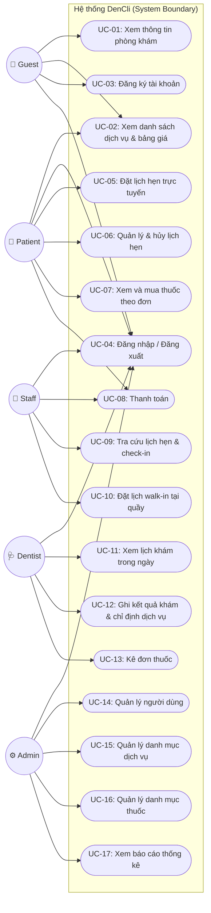
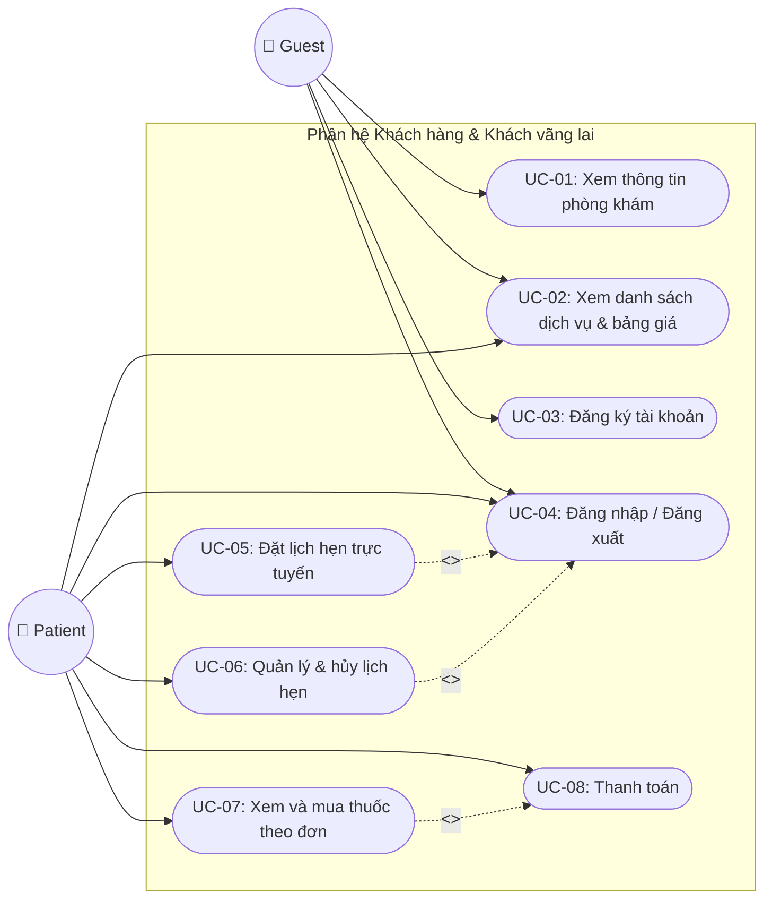
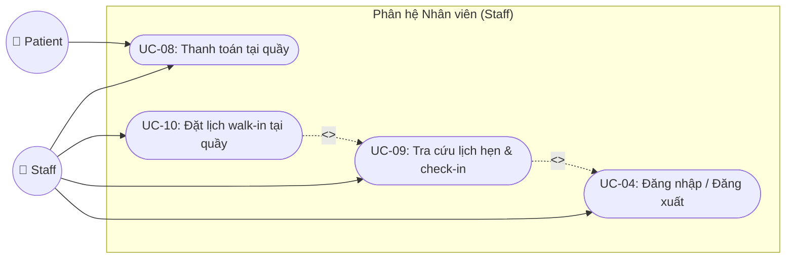
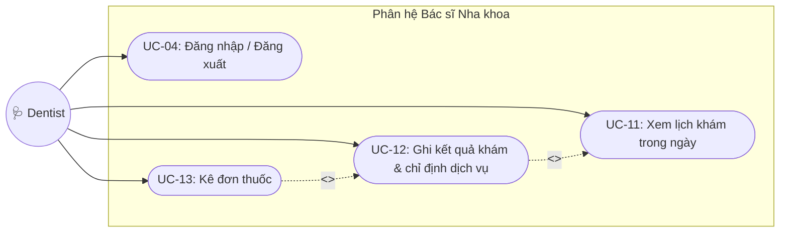
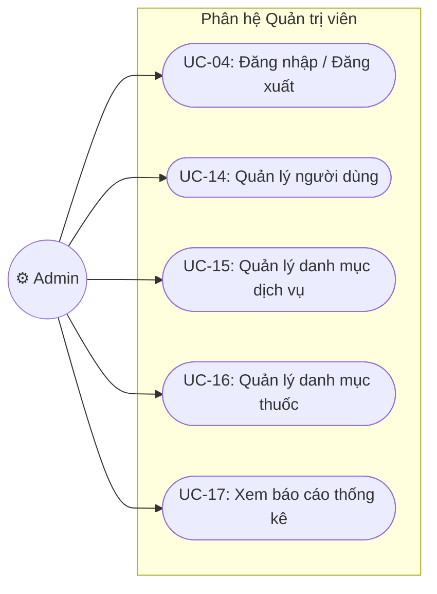

# SƠ ĐỒ NGỮ CẢNH & USE CASE - HỆ THỐNG QUẢN LÝ PHÒNG KHÁM NHA KHOA (DenCli)

Tài liệu này trình bày thiết kế **Sơ đồ Ngữ cảnh (Context Diagram)** và các **Sơ đồ Use Case (Use Case Diagram)** cho hệ thống quản lý phòng khám nha khoa **DenCli** dựa trên tài liệu SRS được cung cấp.

> [!TIP]
> **Tích hợp Draw.io AI Kit:**
> Tôi đã sử dụng bộ công cụ `drawio-ai-kit` để xây dựng và xuất bản 5 sơ đồ dưới dạng tệp `.drawio` được căn chỉnh tọa độ tự động, có cấu trúc đẹp mắt và tuân thủ các nguyên tắc thiết kế.
> 
> Bạn có thể mở trực tiếp các tệp này bằng phần mềm [Draw.io Desktop](https://www.draw.io/) hoặc trang web Draw.io trực tuyến:
> - 🌐 **Sơ đồ Ngữ cảnh:** [context_diagram.drawio](file:///C:/Users/ad/.gemini/antigravity-ide/scratch/drawio-ai-kit/out/context_diagram.drawio)
> - 🌐 **Use Case Tổng thể (Overall):** [usecase_overall.drawio](file:///C:/Users/ad/.gemini/antigravity-ide/scratch/drawio-ai-kit/out/usecase_overall.drawio)
> - 🌐 **Use Case - Khách hàng & Bệnh nhân:** [usecase_patient.drawio](file:///C:/Users/ad/.gemini/antigravity-ide/scratch/drawio-ai-kit/out/usecase_patient.drawio)
> - 🌐 **Use Case - Nhân viên Tiếp đón:** [usecase_receptionist.drawio](file:///C:/Users/ad/.gemini/antigravity-ide/scratch/drawio-ai-kit/out/usecase_receptionist.drawio)
> - 🌐 **Use Case - Bác sĩ:** [usecase_dentist.drawio](file:///C:/Users/ad/.gemini/antigravity-ide/scratch/drawio-ai-kit/out/usecase_dentist.drawio)
> - 🌐 **Use Case - Quản trị viên:** [usecase_admin.drawio](file:///C:/Users/ad/.gemini/antigravity-ide/scratch/drawio-ai-kit/out/usecase_admin.drawio)

---

## 1. CÁC TÁC NHÂN HỆ THỐNG (ACTORS)

Dựa trên tài liệu SRS, hệ thống tương tác với **5 tác nhân là người dùng** và **1 tác nhân là hệ thống bên ngoài (External System)**:

| Tác nhân | Ký hiệu | Mô tả |
| :--- | :---: | :--- |
| **Khách vãng lai (Guest)** | 👤 | Người dùng chưa có tài khoản, chỉ có thể xem thông tin giới thiệu, dịch vụ, bảng giá và thực hiện đăng ký tài khoản. |
| **Bệnh nhân / Khách hàng (Patient)** | 🤒 | Người dùng đã đăng ký tài khoản, có quyền đặt/hủy lịch hẹn trực tuyến, xem hồ sơ/đơn thuốc, mua thuốc và thực hiện thanh toán. |
| **Nhân viên (Staff)** | 💁 | Nhân viên phòng khám, thực hiện tra cứu lịch hẹn, check-in cho bệnh nhân, đặt lịch walk-in trực tiếp tại quầy và xác nhận thanh toán. |
| **Bác sĩ (Dentist)** | 🩺 | Bác sĩ nha khoa, thực hiện xem lịch khám cá nhân, ghi kết quả chẩn đoán, điều trị, chỉ định dịch vụ phát sinh và kê đơn thuốc cho bệnh nhân. |
| **Quản trị viên (Admin)** | ⚙️ | Quản lý hệ thống, có quyền quản lý người dùng (CRUD, phân quyền, khóa/mở khóa), quản lý danh mục dịch vụ/thuốc và xem báo cáo thống kê. |
| **Hệ thống SMTP Email (SMTP Server)** | 📧 | Hệ thống bên ngoài hỗ trợ gửi email tự động xác nhận đặt lịch hẹn thành công hoặc mã xác nhận (OTP) để lấy lại mật khẩu. |

---

## 2. SƠ ĐỒ NGỮ CẢNH (CONTEXT DIAGRAM - DFD LEVEL 0)

Sơ đồ ngữ cảnh thể hiện ranh giới hệ thống **DenCli** và các luồng thông tin (dữ liệu vào/ra) giữa hệ thống với các tác nhân bên ngoài.

```mermaid
graph TD
    %% Định nghĩa hệ thống trung tâm
    subgraph SystemBoundary ["HỆ THỐNG QUẢN LÝ PHÒNG KHÁM NHA KHOA (DenCli)"]
        DenCli["Hệ thống Web DenCli<br>(Java Servlet/JSP MVC - SQL Server)"]
    end

    %% Định nghĩa các tác nhân bên ngoài
    Guest["👤 Khách vãng lai<br>(Guest)"]
    Patient["🤒 Bệnh nhân<br>(Patient)"]
    Staff["💁 Nhân viên<br>(Staff)"]
    Dentist["🩺 Bác sĩ<br>(Dentist)"]
    Admin["⚙️ Quản trị viên<br>(Admin)"]
    EmailSystem["📧 Hệ thống Email SMTP<br>(External System)"]

    %% Luồng dữ liệu cho Guest
    Guest -->|Yêu cầu thông tin/dịch vụ/bảng giá| DenCli
    Guest -->|Thông tin đăng ký tài khoản| DenCli
    DenCli -->|Thông tin phòng khám/dịch vụ/bảng giá| Guest
    DenCli -->|Kết quả đăng ký tài khoản| Guest

    %% Luồng dữ liệu cho Patient
    Patient -->|Thông tin đăng nhập & xác thực| DenCli
    Patient -->|Yêu cầu đặt/hủy lịch hẹn khám| DenCli
    Patient -->|Lựa chọn mua thuốc theo đơn| DenCli
    Patient -->|Thông tin thanh toán hóa đơn| DenCli
    DenCli -->|Trạng thái đăng nhập & phân quyền| DenCli
    DenCli -->|Thông báo xác nhận đặt/hủy lịch| Patient
    DenCli -->|Chi tiết đơn thuốc đã kê| Patient
    DenCli -->|Hóa đơn & Biên lai thanh toán| Patient

    %% Luồng dữ liệu cho Staff
    Staff -->|Yêu cầu tìm kiếm lịch hẹn| DenCli
    Staff -->|Thao tác check-in bệnh nhân| DenCli
    Staff -->|Thông tin lịch hẹn trực tiếp (Walk-in)| DenCli
    Staff -->|Xác nhận thanh toán tại quầy| DenCli
    DenCli -->|Kết quả tra cứu lịch hẹn| Staff
    DenCli -->|Thông tin phòng khám hướng dẫn| Staff
    DenCli -->|Thông tin hóa đơn dịch vụ/thuốc| Staff

    %% Luồng dữ liệu cho Dentist
    Dentist -->|Yêu cầu xem lịch khám trong ngày| DenCli
    Dentist -->|Kết quả chẩn đoán & điều trị| DenCli
    Dentist -->|Chỉ định dịch vụ phát sinh & kê đơn thuốc| DenCli
    DenCli -->|Danh sách lịch khám sắp xếp theo giờ| Dentist
    DenCli -->|Lịch sử bệnh án của bệnh nhân| Dentist
    DenCli -->|Giá trị tạm tính của đơn thuốc| Dentist

    %% Luồng dữ liệu cho Admin
    Admin -->|Thông tin tài khoản (CRUD/Khóa)| DenCli
    Admin -->|Thông tin danh mục dịch vụ & thuốc| DenCli
    Admin -->|Yêu cầu xuất báo cáo thống kê| DenCli
    DenCli -->|Danh sách người dùng & trạng thái| DenCli
    DenCli -->|Báo cáo thống kê (Doanh thu/Lịch hẹn/Hiệu suất)| Admin

    %% Luồng dữ liệu với Hệ thống Email SMTP
    DenCli -->|Yêu cầu gửi Email (Mã OTP, Xác nhận lịch hẹn)| EmailSystem
```


### Mô tả chi tiết luồng thông tin:
1. **Khách vãng lai (Guest):** Gửi yêu cầu xem thông tin phòng khám và đăng ký tài khoản mới; nhận lại thông tin phản hồi và kết quả tạo tài khoản.
2. **Bệnh nhân (Patient):** Cung cấp thông tin xác thực, thông tin đặt/hủy lịch khám, số lượng thuốc muốn mua và hình thức thanh toán; nhận lại kết quả đăng nhập, thông báo lịch hẹn, thông tin đơn thuốc và hóa đơn thanh toán.
3. **Nhân viên (Staff):** Gửi yêu cầu check-in, thông tin khách hàng walk-in, thông tin hóa đơn; nhận lại thông tin lịch hẹn hiển thị trên hệ thống và số phòng khám tương ứng để hướng dẫn bệnh nhân.
4. **Bác sĩ (Dentist):** Truy vấn lịch khám; gửi kết quả điều trị, chỉ định dịch vụ và đơn thuốc; nhận lại thông tin bệnh án lịch sử của bệnh nhân để hỗ trợ chẩn đoán.
5. **Quản trị viên (Admin):** Quản trị dữ liệu cấu hình hệ thống (người dùng, dịch vụ, thuốc) và gửi yêu cầu kết xuất báo cáo thống kê; nhận lại báo cáo tổng hợp.
6. **Hệ thống Email (SMTP):** Nhận yêu cầu gửi email từ DenCli để chuyển tiếp các thông tin tự động như mã OTP đặt lại mật khẩu hoặc thông báo đặt lịch thành công đến khách hàng.

---

## 3. SƠ ĐỒ USE CASE TỔNG THỂ (OVERALL USE CASE DIAGRAM)

Sơ đồ Use Case tổng thể mô tả toàn bộ mối quan hệ giữa các tác nhân và 17 Use Case nghiệp vụ chính được định nghĩa trong SRS.




---

## 4. SƠ ĐỒ USE CASE PHÂN HỆ CHI TIẾT (MODULAR USE CASE DIAGRAMS)

Để sơ đồ không bị quá tải thông tin, dưới đây là thiết kế chia nhỏ theo từng phân hệ chức năng tương ứng với các nhóm người dùng chính.

### 4.1 Phân hệ Khách hàng & Khách vãng lai (Guest & Patient Module)
Phân hệ này tập trung vào các tính năng hướng đến đối tượng khách hàng sử dụng dịch vụ trực tuyến.

> [!NOTE]
> Các mối quan hệ phụ trợ như `<<include>>` (bao gồm) và `<<extend>>` (mở rộng) được sử dụng để thể hiện logic nghiệp vụ chặt chẽ:
> - Đặt lịch hẹn trực tuyến (`UC-05`) **yêu cầu bắt buộc (include)** Đăng nhập hệ thống (`UC-04`).
> - Xem và mua thuốc theo đơn (`UC-07`) **yêu cầu bắt buộc (include)** thực hiện Thanh toán (`UC-08`) khi người dùng quyết định mua.




---

### 4.2 Phân hệ Tiếp đón & Bán hàng tại quầy (Staff Module)
Phân hệ dành cho nhân viên tiếp tiếp đón để xử lý bệnh nhân khi đến phòng khám và hỗ trợ thanh toán.

> [!NOTE]
> - Tạo lịch Walk-in tại quầy (`UC-10`) sẽ **tự động bao gồm (include)** quy trình Check-in (`UC-09`) để bệnh nhân có thể vào phòng khám ngay lập tức.
> - Cả Bệnh nhân (`Patient`) và Nhân viên (`Staff`) đều tham gia vào Use Case Thanh toán (`UC-08`).




---

### 4.3 Phân hệ Chuyên môn của Bác sĩ (Dentist Module)
Phân hệ hỗ trợ Bác sĩ thực hiện quy trình khám chữa bệnh chính tại phòng khám.

> [!NOTE]
> - Bác sĩ bắt đầu quy trình khám bằng cách chọn một bệnh nhân từ danh sách lịch khám trong ngày (`UC-11`). Do đó việc Ghi kết quả khám (`UC-12`) **yêu cầu (include)** việc Xem lịch khám (`UC-11`).
> - Sau khi khám xong, bác sĩ có thể kê đơn thuốc hoặc không. Việc Kê đơn thuốc (`UC-13`) là một hành động **mở rộng (extend)** từ việc Ghi kết quả khám (`UC-12`).




---

### 4.4 Phân hệ Quản trị hệ thống (Admin Module)
Phân hệ dành riêng cho quản trị viên vận hành hệ thống, danh mục dữ liệu và theo dõi báo cáo.




---

## 5. THUYẾT MINH Ý NGHĨA CÁC USE CASE CHI TIẾT

Bảng dưới đây tóm tắt các Use Case, tác nhân kích hoạt chính (Primary Actor), tác nhân phụ trợ (Secondary Actor - nếu có) và hành vi hệ thống tương ứng:

| Mã UC | Tên Use Case | Tác nhân chính | Tác nhân phụ | Hành vi tóm tắt từ SRS |
| :--- | :--- | :--- | :--- | :--- |
| **UC-01** | Xem thông tin phòng khám | Guest | | Xem giờ mở cửa, thông tin liên hệ, hình ảnh cơ sở vật chất mà không cần đăng nhập. |
| **UC-02** | Xem danh mục dịch vụ & giá | Guest, Patient | | Xem danh sách dịch vụ được gom nhóm, tìm kiếm theo tên hoặc danh mục, sắp xếp theo giá. |
| **UC-03** | Đăng ký tài khoản | Guest | | Đăng ký tài khoản Patient bằng Họ tên, SĐT (duy nhất), Email, Mật khẩu (được băm bảo mật). |
| **UC-04** | Đăng nhập / Đăng xuất | Tất cả | | Đăng nhập dựa trên vai trò. Khóa tài khoản nếu nhập sai 5 lần. Hủy phiên làm việc khi đăng xuất. |
| **UC-05** | Đặt lịch hẹn trực tuyến | Patient | | Chọn bác sĩ, chọn khung giờ trống theo ngày (ràng buộc không trùng lịch), chọn dịch vụ hoặc khám tổng quát. |
| **UC-06** | Quản lý & hủy lịch hẹn | Patient | | Xem lịch hẹn theo trạng thái (sắp tới, đã hủy...). Hủy lịch hẹn trước giờ khám tối thiểu 02 giờ. |
| **UC-07** | Xem và mua thuốc theo đơn | Patient | | Xem các đơn thuốc được kê, điều chỉnh số lượng mua thực tế (không vượt quá lượng kê), tự động tính tiền. |
| **UC-08** | Thanh toán | Patient, Staff| | Tạo hóa đơn dịch vụ/thuốc. Hỗ trợ tiền mặt tại quầy hoặc chuyển khoản thủ công. Cập nhật hóa đơn "Đã thanh toán". |
| **UC-09** | Tra cứu lịch & Check-in | Staff | | Tìm kiếm lịch hẹn theo SĐT, Tên, Bác sĩ. Thực hiện check-in khi bệnh nhân có mặt, chỉ định số phòng. |
| **UC-10** | Đặt lịch Walk-in tại quầy | Staff | | Tạo hồ sơ khách hàng nhanh (nếu chưa có). Đăng ký bác sĩ, khung giờ trống, tự động gán trạng thái "Đã check-in". |
| **UC-11** | Xem lịch khám trong ngày | Dentist | | Xem danh sách bệnh nhân được xếp lịch theo thứ tự thời gian. Chọn bệnh nhân đã check-in để khám. |
| **UC-12** | Ghi kết quả & chỉ định | Dentist | | Nhập chẩn đoán, ghi chú điều trị. Chỉ định thêm dịch vụ phát sinh. Lưu kết quả vào bệnh án và hoàn tất lịch khám. |
| **UC-13** | Kê đơn thuốc | Dentist | | Chọn thuốc từ danh mục, nhập số lượng, liều dùng, hướng dẫn sử dụng. Tự động tính giá trị đơn thuốc. |
| **UC-14** | Quản lý người dùng | Admin | | CRUD tài khoản Receptionist, Dentist, Admin. Khóa/Mở khóa tài khoản, đặt lại mật khẩu và phân vai trò. |
| **UC-15** | Quản lý danh mục dịch vụ | Admin | | CRUD danh mục và chi tiết dịch vụ. Không cho phép xóa dịch vụ đã có trong lịch sử (chỉ ngừng kích hoạt). |
| **UC-16** | Quản lý danh mục thuốc | Admin | | CRUD danh mục thuốc, quản lý đơn giá, đơn vị tính, số lượng tồn kho thủ công. |
| **UC-17** | Xem báo cáo thống kê | Admin | | Xem thống kê số lượng lịch hẹn, doanh thu (theo dịch vụ/thuốc) theo mốc thời gian, hiệu suất làm việc bác sĩ. |
